# 📊 VISUAL ERD DIAGRAM - STEA PAYROLL SYSTEM

## 🎯 Complete Entity Relationship Diagram

```mermaid
erDiagram
    %% Core User Management
    USERS {
        bigint id PK
        string employee_id UK
        string username UK
        string email UK
        string password
        string first_name
        string last_name
        string phone
        enum gender
        date birth_date
        text address
        string profile_photo
        enum status
        timestamp last_login_at
        timestamps created_at_updated_at
    }

    EMPLOYEES {
        bigint id PK
        bigint user_id FK
        bigint department_id FK
        bigint position_id FK
        bigint supervisor_id FK
        date hire_date
        date contract_start
        date contract_end
        enum employment_type
        enum employment_status
        decimal basic_salary
        string bank_name
        string bank_account
        string bank_account_name
        string tax_id
        string social_security_id
        timestamps created_at_updated_at
    }

    %% Organizational Structure
    DEPARTMENTS {
        bigint id PK
        string code UK
        string name
        text description
        bigint manager_id FK
        boolean is_active
        timestamps created_at_updated_at
    }

    POSITIONS {
        bigint id PK
        bigint department_id FK
        string code UK
        string name
        text description
        integer level
        decimal base_salary
        boolean is_active
        timestamps created_at_updated_at
    }

    %% Authentication & Authorization
    ROLES {
        bigint id PK
        string name UK
        string display_name
        text description
        boolean is_active
        timestamps created_at_updated_at
    }

    PERMISSIONS {
        bigint id PK
        string name UK
        string display_name
        string module
        text description
        timestamps created_at_updated_at
    }

    USER_ROLES {
        bigint id PK
        bigint user_id FK
        bigint role_id FK
        timestamp assigned_at
        boolean is_active
        timestamps created_at_updated_at
    }

    ROLE_PERMISSIONS {
        bigint id PK
        bigint role_id FK
        bigint permission_id FK
        timestamp granted_at
        timestamps created_at_updated_at
    }

    %% Attendance System
    ATTENDANCE_RULES {
        bigint id PK
        string name
        time work_start_time
        time work_end_time
        time break_start_time
        time break_end_time
        integer late_tolerance_minutes
        integer early_leave_tolerance_minutes
        decimal overtime_multiplier
        boolean is_default
        boolean is_active
        timestamps created_at_updated_at
    }

    ATTENDANCES {
        bigint id PK
        bigint user_id FK
        bigint attendance_rule_id FK
        date date
        datetime clock_in
        datetime clock_out
        datetime break_start
        datetime break_end
        integer total_work_minutes
        integer total_break_minutes
        integer overtime_minutes
        integer late_minutes
        integer early_leave_minutes
        enum status
        text notes
        string clock_in_location
        string clock_out_location
        string clock_in_ip
        string clock_out_ip
        timestamps created_at_updated_at
    }

    %% Leave Management
    LEAVE_TYPES {
        bigint id PK
        string name
        string code UK
        text description
        integer max_days_per_year
        boolean is_paid
        boolean requires_document
        boolean is_active
        timestamps created_at_updated_at
    }

    LEAVE_REQUESTS {
        bigint id PK
        bigint user_id FK
        bigint leave_type_id FK
        date start_date
        date end_date
        integer total_days
        text reason
        text notes
        string emergency_contact
        string emergency_phone
        text work_handover
        enum status
        bigint approved_by FK
        timestamp approved_at
        text approval_notes
        json attachments
        boolean is_half_day
        enum half_day_type
        timestamps created_at_updated_at
    }

    %% Permit System
    PERMIT_TYPES {
        bigint id PK
        string name
        string code UK
        text description
        boolean requires_approval
        boolean affects_attendance
        boolean is_active
        integer sort_order
        timestamps created_at_updated_at
    }

    DAY_EXCHANGES {
        bigint id PK
        bigint user_id FK
        date original_work_date
        date replacement_date
        text reason
        enum status
        bigint approved_by FK
        timestamp approved_at
        text approval_notes
        boolean is_completed
        timestamp completed_at
        timestamps created_at_updated_at
    }

    OVERTIME_REQUESTS {
        bigint id PK
        bigint user_id FK
        date overtime_date
        time start_time
        time end_time
        decimal planned_hours
        decimal actual_hours
        text work_description
        text reason
        enum status
        bigint approved_by FK
        timestamp approved_at
        text approval_notes
        boolean is_completed
        timestamp completed_at
        decimal overtime_rate
        decimal overtime_amount
        timestamps created_at_updated_at
    }

    PERMIT_APPROVALS {
        bigint id PK
        string approvable_type
        bigint approvable_id
        bigint approver_id FK
        integer approval_level
        enum status
        timestamp approved_at
        text notes
        timestamps created_at_updated_at
    }

    %% Payroll System
    SALARY_COMPONENTS {
        bigint id PK
        string name
        string code UK
        enum type
        enum calculation_type
        decimal default_amount
        decimal percentage
        text formula
        boolean is_taxable
        boolean is_active
        timestamps created_at_updated_at
    }

    USER_SALARY_COMPONENTS {
        bigint id PK
        bigint user_id FK
        bigint salary_component_id FK
        decimal amount
        date effective_date
        date end_date
        boolean is_active
        timestamps created_at_updated_at
    }

    PAYROLL_PERIODS {
        bigint id PK
        string name
        date start_date
        date end_date
        date pay_date
        enum status
        bigint created_by FK
        bigint approved_by FK
        timestamp approved_at
        timestamps created_at_updated_at
    }

    PAYROLLS {
        bigint id PK
        bigint payroll_period_id FK
        bigint user_id FK
        decimal basic_salary
        decimal total_allowances
        decimal total_deductions
        decimal overtime_amount
        decimal gross_salary
        decimal tax_amount
        decimal net_salary
        integer total_working_days
        integer total_present_days
        integer total_absent_days
        integer total_late_days
        decimal total_overtime_hours
        enum status
        text notes
        timestamps created_at_updated_at
    }

    PAYROLL_DETAILS {
        bigint id PK
        bigint payroll_id FK
        bigint salary_component_id FK
        decimal amount
        text calculation_notes
        timestamps created_at_updated_at
    }

    %% Relationships
    USERS ||--|| EMPLOYEES : "has"
    USERS ||--o{ USER_ROLES : "has"
    USERS ||--o{ ATTENDANCES : "records"
    USERS ||--o{ LEAVE_REQUESTS : "submits"
    USERS ||--o{ DAY_EXCHANGES : "requests"
    USERS ||--o{ OVERTIME_REQUESTS : "requests"
    USERS ||--o{ PAYROLLS : "receives"
    USERS ||--o{ USER_SALARY_COMPONENTS : "has"

    DEPARTMENTS ||--o{ POSITIONS : "contains"
    DEPARTMENTS ||--o{ EMPLOYEES : "employs"
    DEPARTMENTS }o--|| USERS : "managed_by"

    POSITIONS ||--o{ EMPLOYEES : "assigned_to"

    EMPLOYEES }o--|| USERS : "supervised_by"

    ROLES ||--o{ USER_ROLES : "assigned_to"
    ROLES ||--o{ ROLE_PERMISSIONS : "has"

    PERMISSIONS ||--o{ ROLE_PERMISSIONS : "granted_to"

    ATTENDANCE_RULES ||--o{ ATTENDANCES : "governs"

    LEAVE_TYPES ||--o{ LEAVE_REQUESTS : "categorizes"
    LEAVE_REQUESTS }o--|| USERS : "approved_by"

    DAY_EXCHANGES }o--|| USERS : "approved_by"
    OVERTIME_REQUESTS }o--|| USERS : "approved_by"

    PERMIT_APPROVALS }o--|| USERS : "approved_by"

    SALARY_COMPONENTS ||--o{ USER_SALARY_COMPONENTS : "applied_to"
    SALARY_COMPONENTS ||--o{ PAYROLL_DETAILS : "calculated_in"

    PAYROLL_PERIODS ||--o{ PAYROLLS : "contains"
    PAYROLL_PERIODS }o--|| USERS : "created_by"
    PAYROLL_PERIODS }o--|| USERS : "approved_by"

    PAYROLLS ||--o{ PAYROLL_DETAILS : "detailed_by"
```

## 🔗 Key Relationship Patterns

### 1. **User-Centric Design**
- All major entities connect to USERS as the central hub
- Employee data extends user information (1:1)
- All activities tracked per user (attendance, leaves, payroll)

### 2. **Hierarchical Structure**
- Departments → Positions → Employees
- Supervisor relationships within employees
- Manager assignments for departments

### 3. **Authorization Flow**
- Users → Roles → Permissions (RBAC pattern)
- Multi-level approval system for permits

### 4. **Payroll Integration**
- Attendance data feeds into payroll calculation
- Salary components applied per user
- Period-based payroll processing

### 5. **Audit Trail**
- All entities have timestamps
- Approval tracking with user references
- Status progression tracking

## 📊 Database Statistics

- **Total Tables**: 21
- **Core Entities**: 6 (Users, Employees, Departments, Positions, Roles, Permissions)
- **Feature Modules**: 4 (Attendance, Leave, Permit, Payroll)
- **Junction Tables**: 4 (Many-to-many relationships)
- **Lookup Tables**: 3 (Rules, Types, Components)

## 🎯 ERD Compliance

✅ **3NF Normalized**: No redundant data
✅ **Referential Integrity**: All foreign keys properly defined
✅ **Performance Optimized**: Strategic indexing
✅ **Scalable Design**: Supports growth and extensions
✅ **Business Logic**: Reflects real-world HR processes
